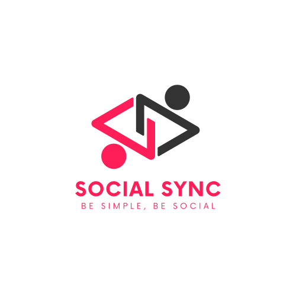

<div id='top' align="center">



SocialSync is a social media platform built with the web technologies including [TypeScript](https://www.typescriptlang.org/), [React](https://reactjs.org/), [Sass](https://sass-lang.com/), [Nodejs](https://nodejs.org/en/), [Express](https://expressjs.com/), and [MySQL](https://www.mysql.com/). With its sleek and intuitive interface, users can easily create profiles, connect with friends, and share photos and posts with their network.

<p>To show your support, kindly consider creating a <strong>Pull Request</strong> and favoriting this repository with a <strong>star ⭐</strong><br/> Your support means a lot to me.❤️</p>

<p>

&nbsp;
&nbsp;
&nbsp;
&nbsp;
&nbsp;


</p>

<p>

[Technologies](#technologies) •
[Demo](#demo) •
[Features](#features) •
[Getting started](#getting-started) •
[Contributing](#contributing) •
[Contact Me](#contact-me)

</p>

</div>

## 🔧Technologies

&nbsp;
&nbsp;
&nbsp;
&nbsp;
&nbsp;
&nbsp;

## ✨Demo
https://user-images.githubusercontent.com/79522638/224509076-2c687bb6-7fc9-4c48-aebe-be8e645143f4.mp4

## 🔥Features

- Follow and unfollow other users
- Liking and disliking user posts
- Write a comment
- Updating user information, including profile picture, background, name, etc.
- Using Context-API as state management
- Fully responsive
- Multi-theme (Dark/Light)

<p align="right">(<a href="#top">BACK TO TOP 🔝</a>)</p>

## 🚀Getting Started

1. Sign up in one of the Cloud computing services sites (I used [Liara](https://liara.ir/)) and get `DB_HOST`, `DB_USER`, `DB_PASSWORD`, `DB_NAME` and `DB_PORT`.

2. Clone the project

```bash
git clone https://github.com/amirmalekian/SocialSync.git
```

3. Install project dependencies for both the api folder and the client

```bash
npm install
#or
yarn add
```

4. Add `.env` file to root api folder project, and enter your‍ ‍`PORT`, `JWT_KEY` with Database information  into `.env`

```js
PORT=[ENTER YOUR DESIRED PORT]
JWT_KEY=[ENTER YOUR TOKEN]
DB_HOST=[ENTER YOUR DB_HOST]
.
.
.
```

5. Run the development server for both the api and client in the root path of both folders:

```bash
npm run dev
# or
yarn dev
```

Open [http://localhost:5173](http://localhost:5173) with your browser to see the result.

## 🤝Contributing

The community is always looking for talented individuals to share their knowledge and creativity to build innovative projects that will change the world.

Contributing to open source projects not only benefits the community, but it also helps you grow as a developer by learning new skills, collaborating with others, and gaining recognition for your contributions.

We greatly appreciate any contribution you can make to our project. Whether it's a suggestion, bug report, or enhancement, your input is invaluable to us.


1. Fork the Project
2. Create your Feature Branch (`git checkout -b feature/AmazingFeature`)
3. Commit your Changes (`git commit -m 'Add some AmazingFeature'`)
4. Push to the Branch (`git push origin feature/AmazingFeature`)
5. Open a Pull Request

Don't forget to give our project a star to show your support! We're excited to see what amazing features you'll bring to our project. Thank you for your contributions!

## 💬Contact Me

  <p>
  if you need help, ask me. I will try to answer as soon as possible.
  </p>

  <p>
    <a href="https://linkedin.com/in/amirmalekian"></a>
    <a href="mailto:amirho3einmalekian@gmail.com"></a>
  </p>
  
  <hr/>
  
  <p align="right">(<a href="#top">BACK TO TOP🔝</a>)</p>
